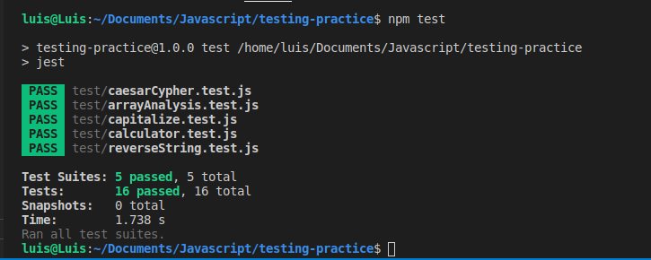

# Javascript Testing Practice

## About
This project is part of the Microverse Curriculum projects. It is a Javascript testing practice.
In this project you can find unit test for each function.

## Built the following functions and respective test:
* Capitalize(string).
* Reverse(string).
* Calculator(sum, subtract, divide and multiply).
* Caesar Cypher
* Array Analysis

## Project specifications
* [The Odin Project: Testing Practice](https://www.theodinproject.com/courses/javascript/lessons/weather-app)

## Build with
* JavaScript
* Jest

## Screeshot


## Getting Started

To get a local copy up and running follow these simple example steps.

### Prerequisites

Ruby: 2.6.5
Rails: 6.0.3

### Setup

Clone or download this repository

```
git clone git@github.com:nriqu322/testing-practice.git
```

### Usage after download or clone repository

Get the dependencies needed for the game:

```
  npm install
```

### Run tests

```
  npm test
```

## Author

👤 **Luis Saavedra**
- Github: [@nriqu322](https://github.com/nriqu322)
- Twitter: [@nriqu322](https://twitter.com/nriqu322)
- Linkedin: [Luis Saavedra](https://linkedin.com/in/luis-saavedra-sanchez/)

---

## 🤝 Contributing

Contributions, issues and feature requests are welcome!

Feel free to check the [issues page](issues/).

## Show your support

Give a ⭐️ if you like this project!

## Acknowledgments

[Microverse](https://microverse.org)

---
